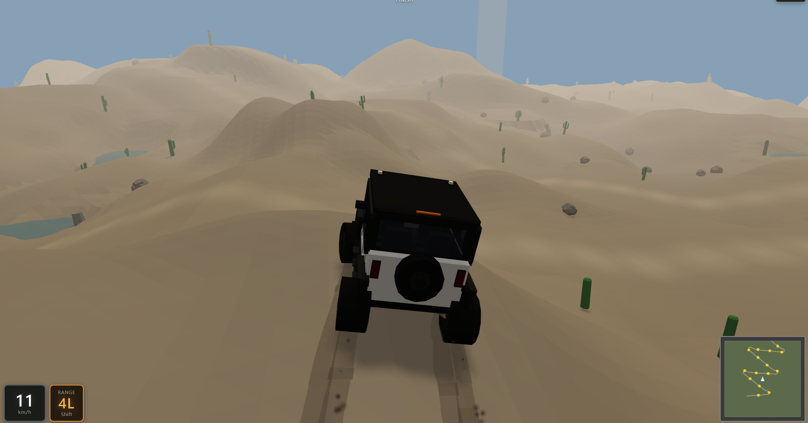
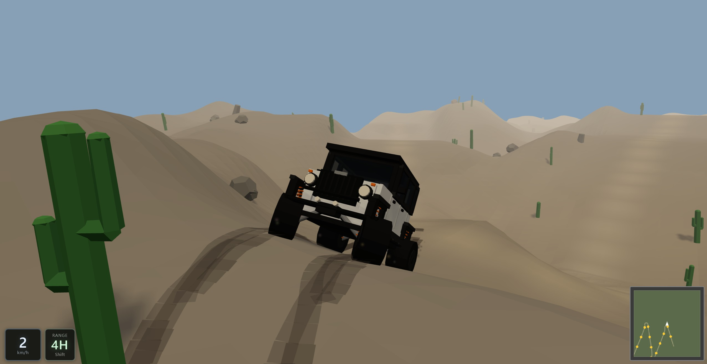
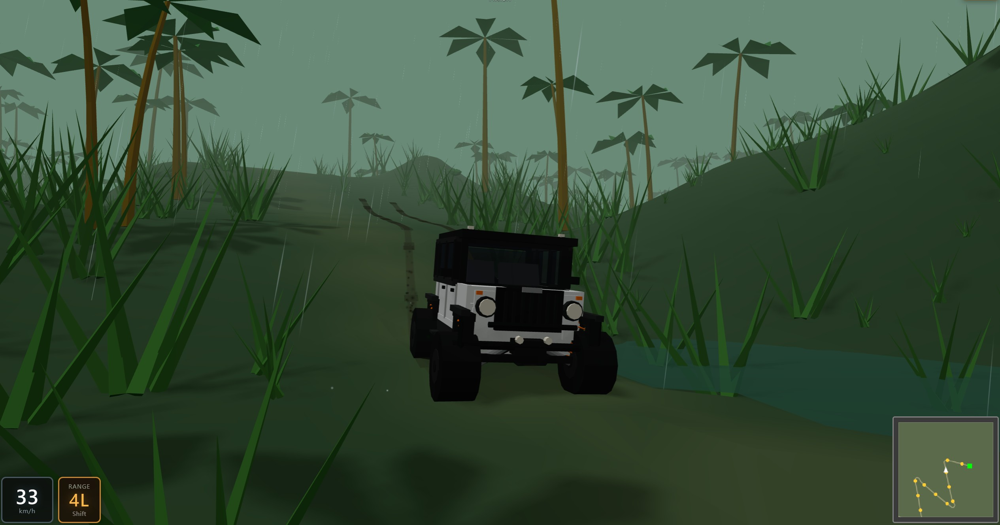
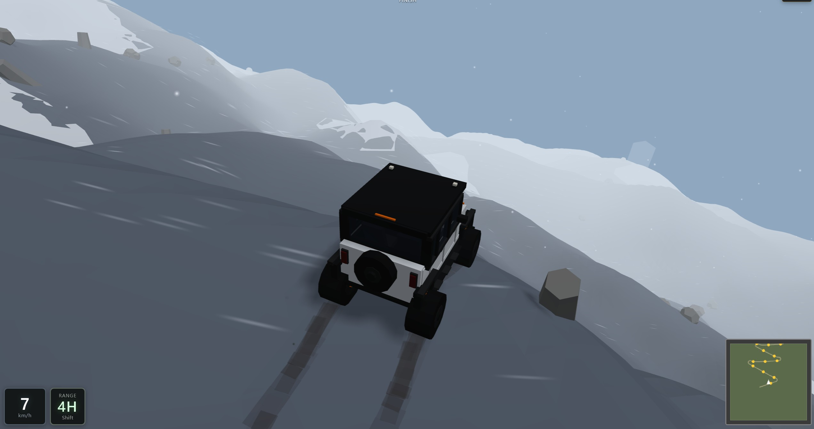
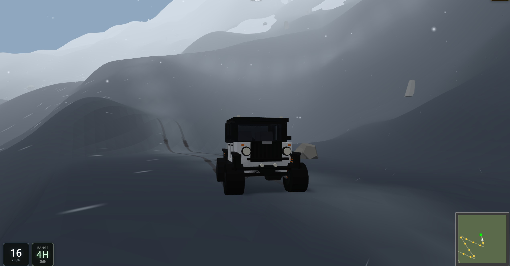

# Low-Poly Jeep Off-Road

**English** | [中文](README.zh-TW.md)

Browser off-road game: a low-poly jeep, procedural trails, and three biomes. Race to the finish — or just enjoy the scramble.

Built with **Grok 4.5** vibe coding.

## Play online

https://wwwang176.github.io/jeepy-offroad/

## Screenshots

### Sand

### Rainforest

### Alpine

## Features

- **Procedural maps** — every run is a new path to the finish
- **Three biomes**
  - **Sand** — dry ridges, cacti, slippery grit
  - **Rainforest** — wet mud, rain, dense palms
  - **Alpine** — long snowy descents, bare rock, blowing spindrift
- **4H / 4L** transfer case — high range for speed, low for crawl and engine brake
- **Tire tracks, dust / mud / snow spray**, and weather per biome
- **Minimap + finish beacon** so you can stay on the trail
- **Desktop & mobile** — keyboard or on-screen stick / pedals
- **EN / 中文** language toggle on the main menu

## Controls

| | Desktop | Mobile |
|--|---------|--------|
| Drive | WASD / arrows | Stick + pedals |
| Brake | W+S (opposite) | Brake pedal |
| 4H ↔ 4L | Shift | RANGE |
| Camera | C · drag to look | Camera button · drag |
| Respawn | R | R |
| Menu | Esc / Menu button | Menu (left of map) |

## Run locally

- `npm run dev` — local game
- `npm test` — unit tests
- `npm run build` — production build
- `npm run preview` — serve production build (base path `/jeepy-offroad/`)
